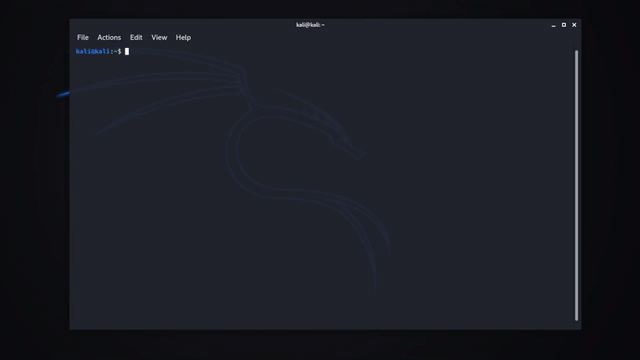
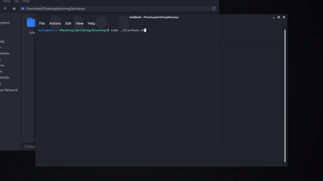

# Phishing Attacks
Fishing someones credentials

#### Requirements
- Kali Linux OS
- Blackeye
- Ngrok/Ngrok account
- Email Account/Email Server
- SET(Social Engineering Toolking), comes preinstalled with Kali Linux
- Fake email template

##### Installing Ngrok
- Make an account at [ngrok](www.ngrok.com)
- open a terminal and type `./ngrok your-access-token`

This will allow us to make free ngrok tunnels

##### Install Blackeye
- open the terminal
- navigate to the directory you want to save blackeye in
- execute this command `git clone https://github.com/x3rz/blackeye`
- if `git` isn't installed, just execute this command `sudo apt install git`

##### Opening blackeye
- open the terminal
- navigate to the folder where **blackeye** is saved
- execute `sudo ./blackeye.sh`

##### Find a Email template
- I just made my own identical looking **google security alert** Email
- You will need this so that the spoofed email you are sending looks real and you can make the victim fall for it.

##### Make a new email address
- I recommend using proton mail, because it's vrey quick at setiing up emails, but gmail is recommended.
- Also, you don't wanna send fishing emails from your main email(always use decoys)

#### Executing the Attack
Now with all the tools installed you can begin the attack.

##### Starting Blackeye
- navigate to the folder where black eye is saved and run the command `sudo ./blackeye.sh`

We are going to fish for google accounts so we will pick the 5th option. After selecting the 5th option, the script will download ngrok and set it up and give you a working, phishy looking ngrok tunnel link.

Now we will need to make the victim cliock on the link and enter their credentials. We can send a spoofed email, pretending we are Google and pretend that someone logged into their account, here's where the email template comes into place.

- follow the video

##### Send the email
You can use the SET(Social Engineering Toolkit) to send a fake email, that the target will go to.

If everything is going according to plan, the target clicked on the link, entered the credentials, then you have their browser information, ip, credentials and much more.
